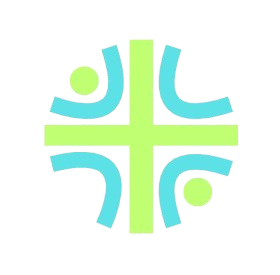

<p align="center">
  
</p>

<h1 align="center">MedEcos Unified Medical Platform</h1>

<p align="center">
  <a href="https://github.com/TanishqAswar/MedEcos/releases/tag/v1.0.0">
    
  </a>
  <a href="https://medecos-frontend.onrender.com">
    
  </a>
  <a href="https://shorebird.dev">
    
  </a>
</p>

🚀 **Download Official Android APK (v1.0.0):** [GitHub Release v1.0.0](https://github.com/TanishqAswar/MedEcos/releases/tag/v1.0.0)  
🌐 **Live Web App:** [medecos-frontend.onrender.com](https://medecos-frontend.onrender.com)

MedEcos is a comprehensive, modern healthcare ecosystem that seamlessly connects Patients, Doctors, Pharmacists, and Pathologists into a unified cross-platform application (Android & Web) powered by a robust Node.js backend.

---

## ✨ Key Highlights in v1.0.0

- 📥 **Official Android Release & Shorebird OTA:** Instantly install the v1.0.0 release APK. Integrated with **Shorebird Code Push** for instant Over-The-Air live patches without APK reinstalls.
- 🔐 **Secure Gmail OTP Verification:** Verified user registration with beautifully styled HTML OTP emails delivered via Brevo API & Nodemailer over TLS.
- 🤖 **AI Prescription & Report Analysis:** Built-in Gemini Vision AI integration that reads physical prescriptions and reports to extract structured medicines, schedules, and physician instructions.
- 🇮🇳 **ABDM & ABHA Gateway Integration:** Seamless integration with Ayushman Bharat Digital Mission (ABDM) ABHA IDs and standardized EHR consent management.
- 📹 **HD Video Teleconsultation:** Low-latency real-time doctor-patient video and audio consultation sessions powered by Agora.

---

## Project Structure

- **[Backend](./Backend/README.md)**: A Node.js/Express REST API utilizing MongoDB. Handles authentication, RBAC, ABDM bridge services, Gemini OCR extraction, email verification, and secure medical data flows.
- **[Frontend](./Frontend/README.md)**: A unified cross-platform Flutter application (`med_ecos_app`) that dynamically adapts UI/UX and routing based on the logged-in user role (**Patient**, **Doctor**, **Pharmacist**, or **Pathologist**).
- **[Tests](./Backend/tests)**: Centralized test and verification scripts for ABDM, AI OCR, Gmail OTP, and authentication flows.

---

## Role-Specific Features

### For Patients
* **Active Medicine Tracker:** Track currently prescribed medicines and dosages.
* **Doctor Appointments & Teleconsulting:** Search verified doctors, book appointments, and join HD video consultations directly inside the app.
* **Comprehensive Health Records:** Securely view past prescriptions, diagnostic lab reports, and manage an ABHA ID profile.

### For Doctors
* **Unified Patient Roster:** Automatically look up and track patient interaction histories.
* **ABHA Integration:** Instantly query national ABHA registries to fetch verified patient records.
* **Digital Prescriptions & AI Digitization:** Issue structured digital prescriptions with visual frequency indicators or digitize physical prescriptions using AI.
* **PDF Export:** Generate high-quality downloadable PDF prescriptions.

### For Pharmacists
* **Global Patient & ABHA Lookup:** Look up active prescriptions tied to patient profiles or ABHA IDs.
* **Prescription Verification & Fulfillment:** Verify prescriptions and attach pharmacist notes directly to patient records.

### For Pathologists
* **Diagnostic Management:** Manage diagnostic lab test requests and upload verified diagnostic reports.

---

## 📥 Android APK Installation (v1.0.0)

1. Download `app-release.apk` from our **[v1.0.0 Release Page](https://github.com/TanishqAswar/MedEcos/releases/tag/v1.0.0)**.
2. Open the APK on your Android device and enable **Install from unknown sources** if prompted.
3. Tap **Install** and launch **MedEcos**.

---

## Getting Started Locally

To launch the entire platform locally:

```bash
# In the root directory, run:
./start_all.sh
```

This starts the Node.js backend on Port 5000, seeds realistic mock data into MongoDB, and serves the Flutter Web frontend on Port 3000.

For detailed documentation:
- [Backend Documentation](./Backend/README.md)
- [Frontend Documentation](./Frontend/README.md)
