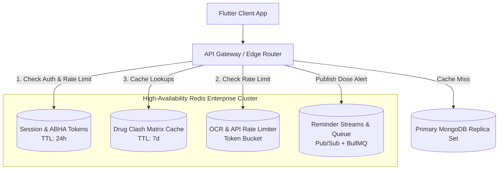
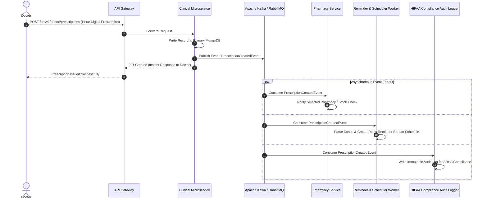
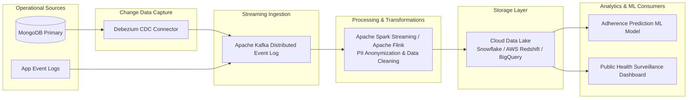

# Enterprise Architecture Blueprint: Redis, Distributed Systems & Data Engineering in MedEcos

MedEcos connects **Patients, Doctors, Pharmacists, and Pathologists** across India. As the platform scales to handle millions of daily prescriptions, IoT vitals, real-time video consultations, and AI-driven diagnostics, a monolithic architecture must transition into an elastic, resilient, and highly performant distributed system.

This document details how **Redis**, **Distributed Microservices**, and **Data Engineering** are architected to power MedEcos at scale.

---

## Table of Contents
1. [Redis Architecture & Caching Strategies](#1-redis-architecture--caching-strategies)
2. [Distributed Systems & Event-Driven Microservices](#2-distributed-systems--event-driven-microservices)
3. [Data Engineering & Analytics Pipeline](#3-data-engineering--analytics-pipeline)
4. [End-to-End System Topology Diagram](#4-end-to-end-system-topology-diagram)

---

## 1. Redis Architecture & Caching Strategies

Redis serves as an in-memory, sub-millisecond data fabric across MedEcos. It prevents database bottlenecks, handles ephemeral state, and orchestrates real-time event distribution.

### Key Use Cases in MedEcos

#### 1. ABHA / JWT Session & Identity Caching
- **Problem**: Every authenticated API request (`/api/v1/patient/*`, `/api/v1/doctor/*`) executes middleware (`protect`) that queries MongoDB for user details (`User.findById(decoded.id)`).
- **Redis Solution**: Store authenticated session profiles in hash sets (`HMSET user:session:{id}`).
- **Key Pattern**: `user:session:<userId>` -> `{ role: "Patient", abhaId: "91-XXXX", name: "...", verified: true }`
- **Impact**: Reduces MongoDB read latency from `12-25 ms` down to `< 0.8 ms` and saves ~75% of primary DB IOPS.

#### 2. Drug Interaction & Formulary Caching
- **Problem**: When `GeminiService.checkMedicineClashes()` or the backend checks whether new medicines interact adversely with a patient's current regimen, querying AI models or complex join tables is expensive.
- **Redis Solution**: Cache national drug interaction matrices and previous AI clash verification outputs.
- **Key Pattern**: `clash:<medLower1>:<medLower2>` -> `"CLASH: Severe increased risk of GI bleeding..."` (TTL: 7 days).

#### 3. Sliding-Window API Rate Limiting
- **Problem**: Resource-intensive endpoints—such as AI Prescription OCR (`POST /api/v1/patient/prescriptions/upload`) and Agora Video Call initialization—are vulnerable to abuse or accidental infinite retry loops on mobile networks.
- **Redis Solution**: Implement Token Bucket rate limiting using `INCR` and `EXPIRE`. Limit patients to 10 AI prescription scans per hour per IP/ABHA ID.

#### 4. Distributed Medicine Reminder Engine (Redis Streams & Pub/Sub)
- **Problem**: Millions of patients require synchronized notifications at specific times (e.g., `08:00 AM`, `02:00 PM`, `09:00 PM`).
- **Redis Solution**: Use Redis Streams (`XADD reminder:stream * patientId "123" doseTime "08:00" medicine "Amoxicillin"`) coupled with distributed worker nodes running BullMQ to fan out Firebase Cloud Messaging (FCM) notifications reliably.

---

## 2. Distributed Systems & Event-Driven Microservices

To decouple clinical workflows from heavy AI processing and media transcoding, MedEcos transitions to an event-driven architecture.

### Architectural Principles

1. **Service Decomposition**:
   - **Identity Service**: Handles ABHA OAuth2, Aadhaar authentication, and JWT issuance.
   - **Clinical Service**: Manages patient health records, doctor appointments, and prescriptions.
   - **AI & Vision Service**: Python/FastAPI service hosting optimized OCR processing, document parsing, and drug interaction inference engines.
   - **Teleconsultation Service**: Manages Agora signaling channels, WebRTC tokens, and session quality metrics.

2. **Fault Tolerance & Circuit Breaking**:
   - If the AI OCR microservice experiences high latency or rate limits from Google Generative AI, circuit breakers open immediately, serving fast fallback OCR templates without crashing the primary clinical application.

---

## 3. Data Engineering & Analytics Pipeline

MedEcos generates rich longitudinal healthcare data. A state-of-the-art Data Engineering pipeline turns raw events into clinical intelligence and epidemiological monitoring.

### Key Data Engineering Stages

#### Stage 1: Change Data Capture (CDC) via Debezium
- Production databases (MongoDB) should not run heavy analytical aggregation queries.
- **Debezium** tails the MongoDB replication oplog (`oplog.rs`), capturing every insert, update, or delete event (e.g., dose marked taken, new prescription uploaded) and streams it into Apache Kafka topics in real time (`medecos.cdc.prescriptions`, `medecos.cdc.history`).

#### Stage 2: Stream Processing & PII Anonymization (Spark / Flink)
- Apache Spark Streaming consumes raw CDC events and scrubs personally identifiable information (PII) to maintain HIPAA / ABDM (Ayushman Bharat Digital Mission) compliance:
  - Patient Name & Phone -> Replaced with irreversible cryptographic hash salted with tenant key.
  - Diagnostic & Medicine codes -> Standardized to ICD-10 and SNOMED-CT taxonomies.

#### Stage 3: Longitudinal Healthcare Lakehouse
- Anonymized records land in a columnar data warehouse (Snowflake / BigQuery) partitioned by `year/month/pincode`.

#### Stage 4: Downstream Clinical AI Models
- **Medication Adherence Risk Prediction**: ML classification pipelines predict patient drop-off probabilities based on dosing gaps, timing variance, and polypharmacy complexity. High-risk patients trigger automated intervention nudges from the **Vaidya AI Chatbot**.
- **Epidemiological Alerting**: Aggregates medicine demand anomalies (e.g., sudden 300% surge in antipyretic prescriptions in a specific pin code) to alert public health authorities regarding localized viral outbreaks.
