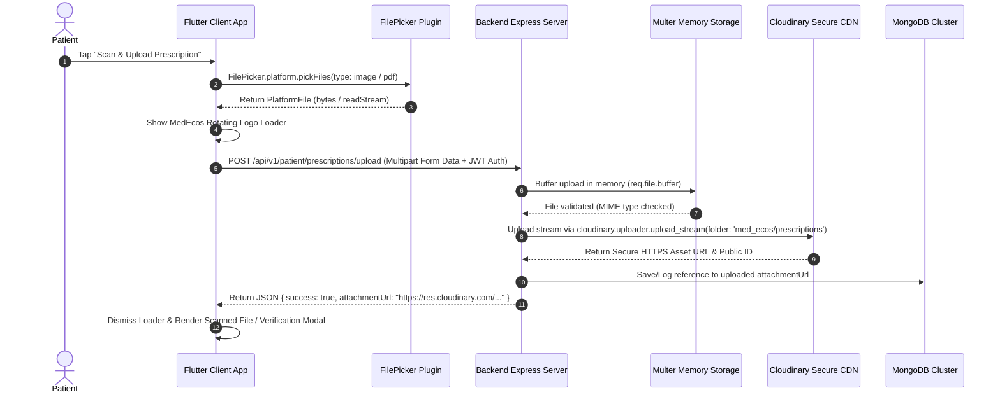

# End-to-End Architecture: Cloudinary File Uploads & CDN Media Pipeline

In MedEcos, medical documents—including handwritten prescription scans, laboratory diagnostic reports, and practitioner verification certificates—must be securely uploaded, analyzed, and stored.

This document details the complete end-to-end media upload lifecycle connecting the **Flutter Mobile/Web Client**, the **Node.js/Express Backend**, **Cloudinary Secure CDN**, and **MongoDB**.

---

## Complete End-to-End Sequence Flowchart



---

## Key Components & Implementation Details

### 1. Client-Side Selection & Multipart Request (Flutter)
The Flutter application uses the `file_picker` plugin to allow patients to capture photos or choose PDF documents seamlessly across iOS, Android, and Web platforms.

#### Cross-Platform Byte Handling
Because web platforms do not expose native file paths (`file.path == null`), MedEcos reads binary buffers directly via `file.bytes` or `file.readStream`:

```dart
final result = await FilePicker.platform.pickFiles(
  type: FileType.custom,
  allowedExtensions: ['jpg', 'jpeg', 'png', 'pdf'],
  withData: true, // Crucial for cross-platform web & mobile stability
);

if (result != null && result.files.single.bytes != null) {
  final fileBytes = result.files.single.bytes!;
  final fileName = result.files.single.name;
  
  // Create Multipart Request
  final request = http.MultipartRequest(
    'POST',
    Uri.parse('\${Constants.baseUrl}/patient/prescriptions/upload'),
  );
  
  request.headers['Authorization'] = 'Bearer \$jwtToken';
  request.files.add(
    http.MultipartFile.fromBytes(
      'file',
      fileBytes,
      filename: fileName,
      contentType: MediaType('image', 'jpeg'),
    ),
  );
  
  final streamedResponse = await request.send();
  final response = await http.Response.fromStream(streamedResponse);
}
```

---

### 2. Backend Middleware Ingestion (Node.js & Multer)
To avoid writing temporary sensitive medical files to disk on intermediate application servers, MedEcos uses `multer.memoryStorage()`. The incoming stream resides entirely in RAM before being piped over TLS directly to Cloudinary.

```javascript
// Backend/src/routes/patientRoutes.js
const multer = require('multer');
const storage = multer.memoryStorage();
const upload = multer({
  storage: storage,
  limits: { fileSize: 10 * 1024 * 1024 }, // 10 MB limit per medical scan
});

router.post('/prescriptions/upload', protect, authorize('Patient'), upload.single('file'), async (req, res) => {
  if (!req.file) {
    return res.status(400).json({ message: 'No file uploaded' });
  }
  // req.file.buffer holds binary file data ready for Cloudinary / AI pipeline
});
```

---

### 3. Streaming Upload to Cloudinary CDN
Cloudinary provides automatic image optimization, format conversion, and global Content Delivery Network (CDN) edge caching.

```javascript
const cloudinary = require('cloudinary').v2;

function uploadBufferToCloudinary(fileBuffer, folderName = 'med_ecos_prescriptions') {
  return new Promise((resolve, reject) => {
    const stream = cloudinary.uploader.upload_stream(
      {
        folder: folderName,
        resource_type: 'auto', // Automatically detects Images vs PDFs
        transformation: [
          { quality: 'auto:good', fetch_format: 'auto' } // Optimizes payload size
        ]
      },
      (error, result) => {
        if (error) return reject(error);
        resolve(result.secure_url);
      }
    );
    stream.end(fileBuffer);
  });
}
```

---

### 4. Security & Access Control
- **Signed HTTPS URLs**: All assets are served strictly via `https://res.cloudinary.com/` ensuring zero unencrypted transit.
- **Tenant Isolation**: Patient files are segregated into isolated folder namespaces keyed by unique user roles and ABHA identifiers (`med_ecos/patients/{abhaId}/prescriptions/`).
