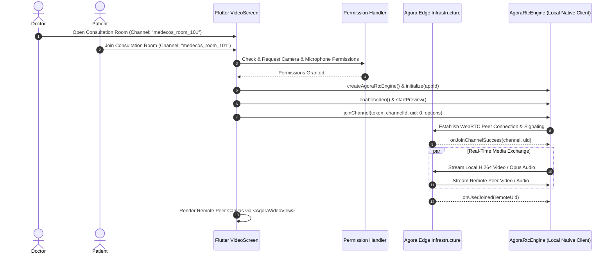
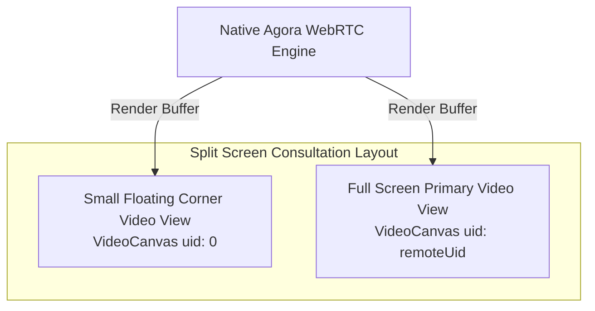

# End-to-End Architecture: Teleconsultation Video Calling (WebRTC & Agora RTC Engine)

MedEcos enables high-definition, low-latency video teleconsultation between Patients and Doctors across mobile networks. This feature utilizes the **Agora RTC Engine SDK (`agora_rtc_engine`)** powered by global WebRTC edge infrastructure.

---

## 1. End-to-End Signaling & Media Flowchart



---

## 2. Key Technical Implementations

### A. Runtime Hardware Permission Management
Before initializing video hardware, Flutter verifies operating system permissions using `permission_handler`:

```dart
import 'package:permission_handler/permission_handler.dart';

Future<bool> requestMediaPermissions() async {
  final statusCam = await Permission.camera.request();
  final statusMic = await Permission.microphone.request();
  return statusCam.isGranted && statusMic.isGranted;
}
```

### B. Agora Engine Initialization & Event Handling
The engine is initialized and configured with event handlers (`RtcEngineEventHandler`) to react dynamically when peers join or drop out:

```dart
import 'package:agora_rtc_engine/agora_rtc_engine.dart';

class VideoCallController {
  late RtcEngine _engine;
  int? _remoteUid;

  Future<void> initAgora(String channelName) async {
    _engine = createAgoraRtcEngine();
    await _engine.initialize(const RtcEngineContext(
      appId: Constants.agoraAppId,
      channelProfile: ChannelProfileType.channelProfileCommunication,
    ));

    _engine.registerEventHandler(
      RtcEngineEventHandler(
        onJoinChannelSuccess: (RtcConnection connection, int elapsed) {
          print("Local user joined channel: \${connection.channelId}");
        },
        onUserJoined: (RtcConnection connection, int remoteUid, int elapsed) {
          // Trigger UI rebuild to render remote doctor/patient video canvas
          _remoteUid = remoteUid;
        },
        onUserOffline: (RtcConnection connection, int remoteUid, UserOfflineReasonType reason) {
          _remoteUid = null;
        },
      ),
    );

    await _engine.enableVideo();
    await _engine.startPreview();
    await _engine.joinChannel(
      token: Constants.agoraTempToken,
      channelId: channelName,
      uid: 0,
      options: const ChannelMediaOptions(),
    );
  }
}
```

---

## 3. Rendering Local & Remote Video Canvas

In Flutter, Agora provides high-performance GPU-backed surface rendering via `AgoraVideoView`:



```dart
// Rendering Remote User Video
Widget buildRemoteVideo() {
  if (_remoteUid != null) {
    return AgoraVideoView(
      controller: VideoViewController.remote(
        rtcEngine: _engine,
        canvas: VideoCanvas(uid: _remoteUid),
        connection: RtcConnection(channelId: widget.channelName),
      ),
    );
  } else {
    return const Center(child: Text("Waiting for peer to join..."));
  }
}
```
