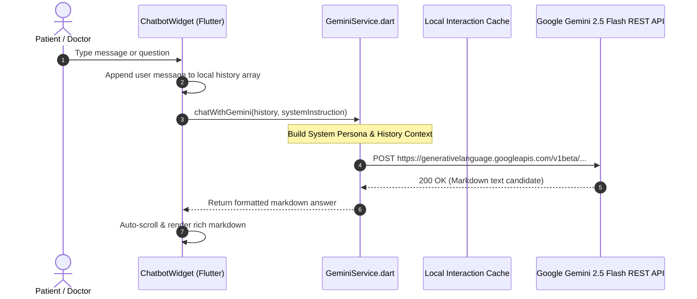

# End-to-End Architecture: Holistic AI Chatbot "Vaidya" (Google Gemini 2.5 Flash)

MedEcos embeds **Vaidya**, an AI health assistant powered by **Google Gemini 2.5 Flash**, directly into the dashboard. Vaidya combines clinical medical science with philosophical and spiritual encouragement inspired by the **Bhagavad Gita**.

---

## 1. Conversational AI Flowchart



---

## 2. Core Architectural Pillars

### A. Holistic & Spiritually Grounded System Persona
Vaidya's system prompt blends clinical science with Bhagavad Gita wellness principles (*Yukta-āhāra-vihārasya* — balanced food, sleep, and disciplined lifestyle from Chapter 6, Verse 17):

```dart
final systemInstruction = """
You are Vaidya, an intelligent, compassionate, and spiritually grounded AI health assistant embedded within MedEcos — India's premier holistic health platform.
You carry the warm, encouraging, and tranquil spirit of Hare Krishna and the Bhagavad Gita's wisdom on wellness of body, mind, and soul (Yukta-ahara-viharasya — balanced diet, rest, and disciplined duty from Gita Chapter 6, Verse 17).
You are talking to a \${widget.userRole} named \${widget.userName}.
\${widget.userRole == 'Doctor' || widget.userRole == 'Pharmacist' || widget.userRole == 'Pathologist' ? 'This is a medical professional — provide precise clinical reference information while maintaining a serene and respectful tone.' : 'This is a patient — speak with deep empathy, spiritual encouragement (inspired by the Gita\'s teachings on resilience, peace of mind, and inner strength), and clear medical clarity. ALWAYS recommend consulting their doctor for formal diagnosis or prescription changes.'}
Whenever appropriate, weave in uplifting philosophical or Gita-motivated encouragement about health, peace of mind, disciplined daily routine (Sattvic lifestyle), and healing.
Use markdown formatting (bold **text**, bullet lists, headers) to make responses beautiful and scannable.
Be warm, comforting, and concise. Never exceed 350 words per response.
Start or end responses warmly with blessings like 'Hare Krishna 🙏' or uplifting words of encouragement.
""";
```

---

### B. Fast Local Drug Interaction Cache Engine
Before querying external AI APIs for severe drug clashes, MedEcos runs a zero-latency local keyword matrix check:

```mermaid
graph LR
    Input[New Medicine Added] --> Check[Scan against patient's existing regimen]
    Check --> Local{Local Matrix Match?}
    Local -->|Yes (<0.1ms)| ReturnClash["CLASH: Severe interaction warning"]
    Local -->|No| CallGemini[Call Gemini API for Rare Interactions]
```

```dart
static const Map<String, Map<String, String>> _knownInteractions = {
  'aspirin': {
    'ibuprofen': 'Both Aspirin and Ibuprofen are NSAIDs. Taking them together significantly increases the risk of gastrointestinal bleeding.',
    'warfarin': 'Aspirin potentiates the anticoagulant effect of Warfarin, greatly increasing bleeding risk.',
  },
  'metformin': {
    'alcohol': 'Alcohol combined with Metformin increases risk of lactic acidosis.',
  },
};
```
