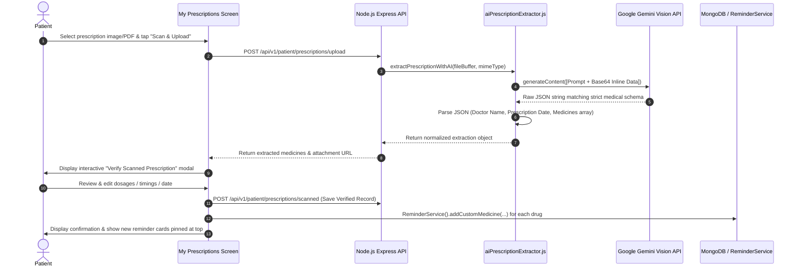
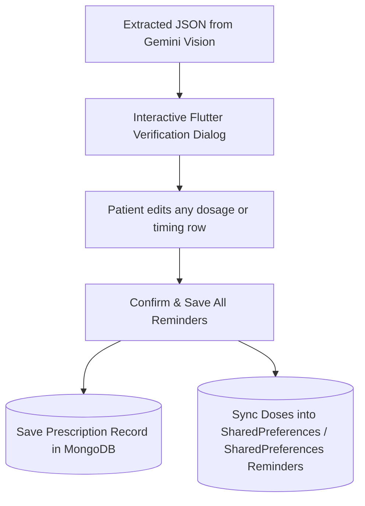

# End-to-End Architecture: AI Prescription OCR & Structured Medicine Extraction

A critical challenge in patient medication compliance is deciphering handwritten or printed prescriptions. MedEcos solves this by utilizing **Google Gemini Vision AI (`gemini-2.5-flash`)** to perform Optical Character Recognition (OCR) and structured medical entity extraction.

---

## 1. End-to-End Extraction Flowchart



---

## 2. Prompt Engineering & JSON Schema Enforcement

To ensure deterministic machine parsing without markdown conversational wrapper noise, MedEcos enforces a strict JSON schema prompt in `aiPrescriptionExtractor.js`:

```javascript
const prompt = `You are an expert medical AI specializing in reading handwritten and printed medical prescriptions.
Analyze this prescription image/document and extract EVERY prescribed medicine listed into a structured JSON array.
Important: A prescription often contains multiple medicines. Carefully inspect every line and return all medicines found.
You MUST respond with ONLY raw JSON — no markdown, no code blocks, no explanation. Just pure JSON matching this schema exactly:
{
  "doctorName": "Doctor's name if visible, else 'Scanned Doctor'",
  "prescriptionDate": "Prescription date if visible formatted as YYYY-MM-DD, else today's date in YYYY-MM-DD format",
  "diagnosis": "Diagnosis or complaint if visible, else 'General Prescription'",
  "medicines": [
    {
      "name": "Full medicine name with strength (e.g. Paracetamol 500mg, Amoxicillin 500mg)",
      "dosage": "Dosage unit (e.g. 1 Tablet, 10 ml)",
      "timing": "Standardized timing: must be one or combination of 'Morning', 'Afternoon', 'Evening', 'Night' (e.g. 'Morning, Night' for BD/twice daily)",
      "context": "Must be one of: 'After Food', 'Before Food', 'With Food'",
      "durationDays": number of days (integer, e.g. 5, 7, 0 if ongoing),
      "instruction": "Special instructions if any"
    }
  ]
}`;
```

---

## 3. Human-In-The-Loop Verification

No AI OCR is 100% infallible on complex handwriting. MedEcos enforces a **Human-In-The-Loop verification modal** before committing extracted prescriptions to active dosing schedules:


