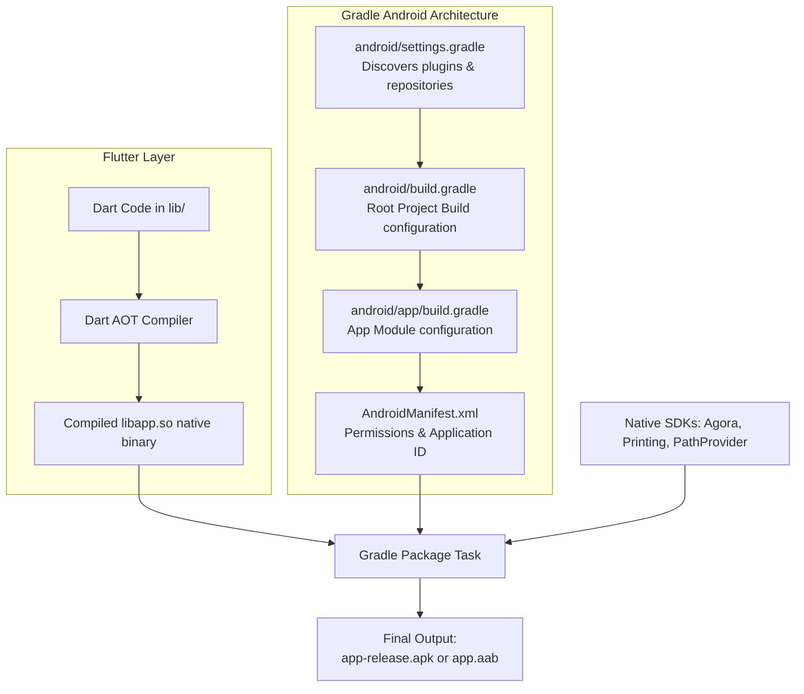

# End-to-End Architecture: Gradle Build System & Android Native Compilation in Flutter

While Flutter writes UI logic in **Dart**, compiling an Android APK or Android App Bundle (AAB) relies entirely on the **Gradle Build System**. Gradle coordinates the Android SDK tools, native C++ libraries (such as Agora WebRTC engines), and third-party Android plugins.

---

## 1. End-to-End Build Pipeline Flowchart



---

## 2. Key Files in MedEcos Android Hierarchy

### 1. `android/settings.gradle`
Acts as the entry point for Gradle configuration. It loads Flutter's plugin auto-loader (`flutter.groovy`) which inspects `pubspec.yaml` and binds native Android modules for dependencies like `agora_rtc_engine`, `file_picker`, and `flutter_local_notifications`:

```groovy
pluginManagement {
    def flutterSdkPath = {
        def properties = new Properties()
        file("local.properties").withInputStream { properties.load(it) }
        def flutterSdkPath = properties.getProperty("flutter.sdk")
        assert flutterSdkPath != null, "flutter.sdk not set in local.properties"
        return flutterSdkPath
    }()

    includeBuild("$flutterSdkPath/packages/flutter_tools/gradle")

    repositories {
        google()
        mavenCentral()
        gradlePluginPortal()
    }
}
```

---

### 2. `android/app/build.gradle`
Configures SDK targeting, application ID, signing configs, and ABI architectures for native binaries:

```groovy
android {
    namespace "com.example.med_ecos_app"
    compileSdk flutter.compileSdkVersion
    ndkVersion flutter.ndkVersion

    defaultConfig {
        applicationId "com.example.med_ecos_app"
        minSdk 21 // Required for Agora RTC WebRTC C++ shared libraries
        targetSdk flutter.targetSdkVersion
        versionCode flutterVersionCode.toInteger()
        versionName flutterVersionName
    }
}
```

---

### 3. Native Android Permissions (`AndroidManifest.xml`)
To support real-time video calls, document scanning, and background reminder notifications, Gradle packages explicit system permissions into the final Android manifest:

```xml
<manifest xmlns:android="http://schemas.android.com/apk/res/android">
    <!-- Camera & Audio for Agora Teleconsultation -->
    <uses-permission android:name="android.permission.CAMERA" />
    <uses-permission android:name="android.permission.RECORD_AUDIO" />
    <uses-permission android:name="android.permission.INTERNET" />
    
    <!-- Exact Alarms & Notifications for Timely Medicine Reminders -->
    <uses-permission android:name="android.permission.SCHEDULE_EXACT_ALARM" />
    <uses-permission android:name="android.permission.POST_NOTIFICATIONS" />
</manifest>
```
