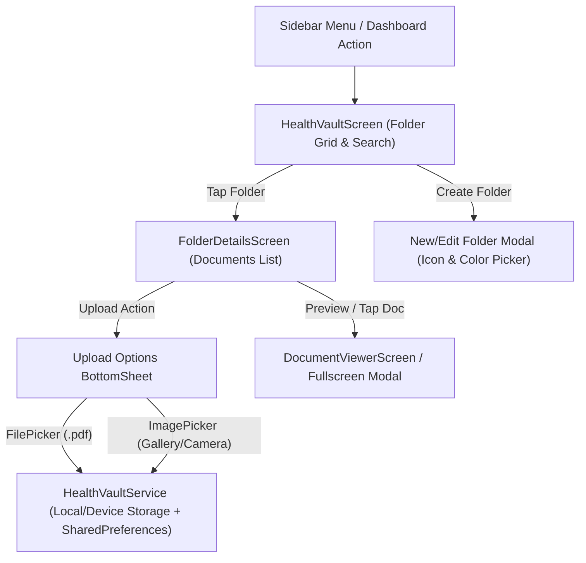

# 08. Health Vault & Medical Locker Architecture

## Overview
The **Health Vault (Medical Locker)** is an end-to-end, highly organized digital repository inside MedEcos that empowers patients and caregivers to store, categorize, preview, and share all their critical medical documents in one secure place.

In real-life medical emergencies or routine consultations, patients frequently struggle to retrieve historical lab reports, discharge summaries, insurance policies, and previous prescriptions. The Health Vault solves this by providing custom folder structures, multi-format file support (`PDF`, `JPG/PNG` via gallery, and direct camera capture), and immediate local persistence synced with user profiles.

---

## Architecture Diagram

---

## Data Models (`lib/features/health_vault/models/`)

### 1. `FolderModel` (`folder_model.dart`)
Represents a user-created or default category folder.
- `id` (`String`): Unique identifier (e.g., `'f_prescriptions'`, `'f_labs'`, or UUID).
- `name` (`String`): Display title (e.g., *"Cardiology Reports"*, *"Insurance & Bills"*).
- `iconCodePoint` (`int`): Material Icon code point (`Icons.folder`, `Icons.biotech`, etc.).
- `colorHex` (`String`): Hex representation of folder accent color (`#2A75D3`, `#10B981`, etc.).
- `isDefault` (`bool`): Flag to prevent accidental deletion of core system folders.
- `createdAt` (`DateTime`): Timestamp of creation.

### 2. `MedicalDocumentModel` (`document_model.dart`)
Represents a single stored document inside a folder.
- `id` (`String`): Unique identifier (`doc_<timestamp>`).
- `folderId` (`String`): Foreign key linking to `FolderModel.id`.
- `title` (`String`): User-friendly document title (e.g., *"CBC Blood Test - Jan 2026"*).
- `fileType` (`String`): `'pdf'` or `'image'`.
- `filePath` (`String`): Local filesystem path or base64 data URL for persistence across restarts.
- `cloudUrl` (`String?`): Optional Cloudinary CDN secure HTTPS URL (`https://res.cloudinary.com/...`) for cloud sync and offline/cross-device recovery.
- `fileSize` (`int`): Size in bytes for display (`KB` / `MB`).
- `uploadDate` (`DateTime`): When the document was added.
- `notes` (`String`): Optional tag or clinical summary note.

---

## Storage & Persistence (`HealthVaultService`)

1. **Local Meta-Storage**: All folder and document metadata is stored using `SharedPreferences` (`health_vault_folders` and `health_vault_documents` JSON arrays) for instant, zero-latency loading.
2. **File Persistence & Hybrid Cloudinary Storage**:
   - **Local Cache**: When files (`PDF` or `Photo`) are selected via `file_picker` or `image_picker`, copies or byte streams are safely cached in application document directories (`health_vault_files/<doc_id>.<ext>`) or encoded as base64 string buffers when lightweight, ensuring instantaneous offline access.
   - **Cloudinary CDN Sync**: During upload (`FolderDetailsScreen._saveAndRegisterFile`), the app automatically attempts a multipart upload (`POST /api/v1/patient/prescriptions/upload`) to Cloudinary (`medecos_reports` raw/image bucket). The returned `secure_url` is stored in `cloudUrl`.
   - **Automatic Fallback Viewer**: If a local file is cleaned up by the operating system or accessed from another device, `DocumentViewerScreen` automatically streams raw bytes directly from `cloudUrl` over high-speed HTTPS.
3. **Smart Defaults**:
   On first launch, the service automatically seeds 5 default folders:
   - 📋 **Prescriptions & Doses** (`#2A75D3`)
   - 🔬 **Lab Reports & Tests** (`#10B981`)
   - 🏥 **Discharge Summaries & Hospital Bills** (`#F59E0B`)
   - 🛡️ **Insurance & ID Cards** (`#8B5CF6`)
   - 🗂️ **Personal & Miscellaneous** (`#64748B`)

---

## User Flows & Screens

### 1. Folder Management (`HealthVaultScreen`)
- Displays a clean 2-column or list grid with custom colored header icons, document counts (`X documents • Last updated: date`), and search filtering.
- Users can tap **`+ New Folder`** to specify a custom name, pick from a curated color palette (Blue, Green, Amber, Purple, Teal, Rose, Indigo), and pick a medical icon.

### 2. Document Upload & Folder Management (`FolderDetailsScreen`)
- Shows all documents stored inside the active folder.
- Action items: **`Rename Folder`** and **`Delete Folder`** (only custom folders or empty default folders can be removed; deleting prompts safety confirmation).
- **`+ Upload Document` Sheet**:
  - **Upload PDF Report**: Triggers `FilePicker.platform.pickFiles(type: FileType.custom, allowedExtensions: ['pdf'])`.
  - **Pick from Gallery**: Triggers `ImagePicker().pickImage(source: ImageSource.gallery)`.
  - **Take Photo (Camera)**: Triggers `ImagePicker().pickImage(source: ImageSource.camera)` for instant physical paper capture.

### 3. Document Preview & Actions
- **Quick Viewer**: Tapping any image document opens an interactive zoomable photo viewer. Tapping a PDF document launches an interactive reader or system handler.
- **Share / Download**: Allows quick export when consulting with doctors in clinic or online.
- **Delete Document**: Prompts before removing file and updating metadata storage.

---

## Integration with Core App
- **Patient Navigation Drawer (`Sidebar`)**: Added as **`Health Vault (Medical Locker)`** directly below *Prescriptions* and *Lab Tests*.
- **Patient Dashboard Card**: Added a dedicated top-level card next to *Find Doctors* / *Scan Prescription* so users can jump directly to their records with one tap.
